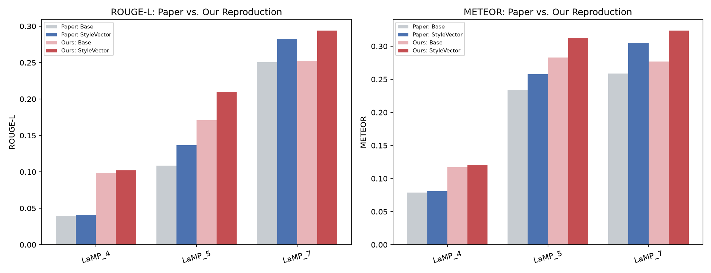

# StyleVector — Reproducing Personalized Text Generation via Contrastive Activation Steering


-lightgrey)

A from-scratch reproduction of **StyleVector** (Zhang et al., *ACL 2025*), a training-free method that captures a user's writing style as a single direction in an LLM's activation space and steers generation toward it. The project includes a large-scale evaluation on three LaMP personalization benchmarks (1,000 users per task) and a live, interactive web demo with an embedded presentation deck.

**Author:** Slok Tulsyan (12342080)

---

## Table of Contents

- [Problem Statement](#problem-statement)
- [The StyleVector Method](#the-stylevector-method)
- [What This Project Does](#what-this-project-does)
- [Experimental Setup](#experimental-setup)
- [Results](#results)
- [Live Demo](#live-demo)
- [Repository Structure](#repository-structure)
- [Getting Started](#getting-started)
- [Limitations](#limitations)
- [Roadmap (End-Term)](#roadmap-end-term)
- [References](#references)
- [Acknowledgements](#acknowledgements)

---

## Problem Statement

Large language models are trained to write in a single, averaged voice, yet many real applications (drafting emails, writing headlines, paraphrasing posts) need text that sounds like a *specific person*. The two dominant approaches to personalization both have drawbacks:

| Approach | How it personalizes | Drawback |
|---|---|---|
| **RAG** (Retrieval-Augmented Generation) | Injects the user's past writing into the prompt | Latency grows with history size; mixes *what* a user writes about with *how* they write |
| **PEFT** (Parameter-Efficient Fine-Tuning) | Trains a small adapter per user | Requires per-user training and storage; does not scale to many users |

**StyleVector** proposes a third option: represent each user's style as **one vector** in the model's hidden-state space and add it back during generation. No retrieval, no training, and only one vector of storage per user.

At the time of writing, the authors had not released official code. The goal of this project is to **reimplement the method from the paper alone, check whether its reported gains reproduce on consumer hardware**, and build a tool that makes the method inspectable on live input.

---

## The StyleVector Method

For a user $u$ with history $P_u = \{(x_i, y_i)\}$ — pairs of task input and the user's authentic response — the method runs in three stages:

**Stage 1: Style-agnostic generation.** A general model produces a content-matched but style-neutral response for each historical input:

$$\hat{y}_i = M_g(x_i)$$

**Stage 2: Contrastive activation extraction.** The last-token hidden state at layer $\ell$ is extracted for the authentic and neutral versions, and the user's style vector is their mean difference:

$$a^{\ell}_{p,i} = h^{\ell}(x_i \oplus y_i), \qquad a^{\ell}_{n,i} = h^{\ell}(x_i \oplus \hat{y}_i)$$

$$s^{\ell}_u = \frac{1}{|P_u|} \sum_{i=1}^{|P_u|} \left( a^{\ell}_{p,i} - a^{\ell}_{n,i} \right)$$

**Stage 3: Steered generation.** The scaled style vector is added to the hidden state at layer $\ell$ for every generated token:

$$h'^{\ell}(x)_t = h^{\ell}(x)_t + \alpha \, s^{\ell}_u$$

```
 User history ──► Stage 1: ŷᵢ = M(xᵢ) ──► Stage 2: mean(h(x⊕y) − h(x⊕ŷ)) ──► Stage 3: h + α·s ──► Personalized output
```

All four equations are implemented with **PyTorch forward hooks**, so activations are read and modified without touching any model weights.

---

## What This Project Does

1. **Faithful reimplementation.** The full pipeline (neutral generation, activation extraction, Mean Difference vector, steering hook) was written from the paper's description, using the paper's model, prompt templates (Appendix E), and decoding strategy.
2. **Large-scale reproduction.** Evaluated on **1,000 users per task** across three LaMP tasks on a single RTX 3060 (12 GB), with every deviation from the paper disclosed.
3. **Interactive demo system.** A Flask web app that runs the method live on real LaMP users or on any text you type, with ROUGE-L/METEOR scoring, a reference-free style-alignment score, and per-user style-vector analytics.
4. **Presentation deck.** A slide deck served by the same app, with the live demo embedded as one of the slides.

---

## Experimental Setup

| Setting | Paper | This reproduction | Reason |
|---|---|---|---|
| Model | Llama-2-7B-chat | `meta-llama/Llama-2-7b-chat-hf` | Matches |
| Quantization | 8-bit | **4-bit NF4** | 8-bit used 11.8/12.3 GB VRAM and caused hangs on the RTX 3060 |
| Hardware | 8× RTX 3090 | 1× RTX 3060 (12 GB) | Compute budget |
| Data split | Test (likely) | **Public dev split** | LaMP test labels are hidden for the leaderboard |
| History per user | Full | **Capped at 15 items** | Compute budget |
| Prompts | Appendix E | Appendix E (exact wording) | Matches |
| Decoding | Greedy | Greedy, max 40 new tokens | Matches |
| Metrics | ROUGE-L, METEOR | ROUGE-L, METEOR | Matches |

### Tasks

| Task | Description | Input → Output |
|---|---|---|
| **LaMP-4** | News Headline Generation | Article → headline |
| **LaMP-5** | Scholarly Title Generation | Paper abstract → title |
| **LaMP-7** | Tweet Paraphrasing | Tweet → paraphrase in the user's voice |

### Steering configuration

Layer and strength were chosen per task by a grid search on a held-out validation subset, then fixed for the full run.

| Task | Layer ℓ | Strength α |
|---|---|---|
| LaMP-4 | 16 | 0.02 |
| LaMP-5 | 16 | 0.02 |
| LaMP-7 | 16 | 0.50 |

---

## Results

StyleVector improves over the non-personalized baseline on **all six task–metric combinations**, in the same direction as the paper and with closely matching relative improvements (n = 1,000 users per task).

| Task | Metric | Paper Base | Paper StyleVector | Paper Δ | **Ours Base** | **Ours StyleVector** | **Ours Δ** |
|---|---|---|---|---|---|---|---|
| LaMP-4 | ROUGE-L | 0.0398 | 0.0411 | +3.3% | 0.0988 | 0.1020 | **+3.3%** |
| LaMP-4 | METEOR | 0.0790 | 0.0809 | +2.4% | 0.1172 | 0.1207 | **+3.0%** |
| LaMP-5 | ROUGE-L | 0.1086 | 0.1366 | +25.8% | 0.1708 | 0.2102 | **+23.1%** |
| LaMP-5 | METEOR | 0.2337 | 0.2575 | +10.2% | 0.2829 | 0.3125 | **+10.5%** |
| LaMP-7 | ROUGE-L | 0.2506 | 0.2827 | +12.8% | 0.2525 | 0.2942 | **+16.5%** |
| LaMP-7 | METEOR | 0.2588 | 0.3042 | +17.5% | 0.2770 | 0.3239 | **+16.9%** |

The raw table is in [`comparison_table.csv`](comparison_table.csv).



### Key finding: reproduction fidelity tracks effect size

Absolute scores differ from the paper (expected given the different split, quantization, and history cap), but the **relative improvements** line up closely. The task with the paper's largest effect (Tweet Paraphrasing) reproduces most cleanly, while the tasks with the smallest effects drift more. Small effects are inherently more sensitive to differences in quantization, data split, and history length, while large effects survive them. Because this pattern comes from comparing across tasks rather than explaining one task after the fact, it is a testable claim rather than a post-hoc excuse.

---

## Live Demo

The demo app is deployed on the lab server:

| Page | URL |
|---|---|
| **Interactive demo** | http://10.10.0.247:5000/ |
| **Presentation deck** (live demo embedded) | http://10.10.0.247:5000/midterm-presentation |

> **Note:** `10.10.0.247` is a private network address, so the links work only from inside the lab/campus network (or over its VPN). From outside, see [Running the web app](#3-running-the-web-app) to host it yourself or tunnel in with SSH.

### What the demo does

1. **Pick a task** (News Headline, Scholarly Title, or Tweet Paraphrasing) and **a person** from the LaMP dataset. Their writing history is shown, and users with the largest benchmark improvement are starred for easy selection.
2. **Choose a mode:**
   - **Write my own prompt:** type any article, abstract, or tweet and see how the model would write it *in that person's style*.
   - **Use this person's held-out test query:** runs on the person's real LaMP test input, so a ground-truth reference exists.
3. **Compare outputs side by side.** The baseline and StyleVector-steered generations are produced live, together with:
   - **ROUGE-L and METEOR** for both outputs (benchmark mode, where a reference exists).
   - **Style alignment score:** cosine similarity between each output's activation and the person's style vector. It needs no reference, so it also works for free-form prompts.
   - **Most influential history items:** which of the person's past writings contributed most to their style vector, ranked by cosine similarity of each item's contrastive delta to the final vector.
   - **Benchmark panel:** the full 1,000-user results table, for context next to the single live example.

Style vectors are cached in memory and on disk (`webapp/webapp_cache/`), so returning to a person is instant. The app imports the same activation extraction, Mean Difference, and steering-hook logic validated in the notebook, so the demo and the batch evaluation cannot silently diverge.

---

## Repository Structure

```
Stylevector/
├── stylevector_phase_2.ipynb     # Main reproduction notebook (data → model → method → evaluation → plots)
├── phase_2_report.pdf            # Midterm report (LaTeX)
├── phase_2_presentation.pdf      # Midterm presentation slides (PDF export)
├── comparison_table.csv          # Final paper-vs-reproduction results table
├── comparison_chart.png          # Grouped bar chart of the results
├── requirements.txt              # Dependencies for running the notebook
├── checkpoints_final/            # Saved evaluation outputs and checkpoints
│   ├── best_config.json          # Best steering configuration found per task
│   ├── full_results.csv          # Aggregated per-user benchmark results
│   ├── results_LaMP_4.jsonl      # Per-user JSONL outputs for LaMP-4
│   ├── results_LaMP_5.jsonl      # Per-user JSONL outputs for LaMP-5
│   ├── results_LaMP_7.jsonl      # Per-user JSONL outputs for LaMP-7
│   └── .ipynb_checkpoints/       # Notebook autosave copies of output artifacts
│       ├── best_config-checkpoint.json
│       ├── full_results-checkpoint.csv
│       ├── results_LaMP_4-checkpoint.jsonl
│       ├── results_LaMP_5-checkpoint.jsonl
│       └── results_LaMP_7-checkpoint.jsonl
└── webapp/
    ├── app.py                    # Flask backend: model loading, StyleVector logic, API routes
    ├── lamp_loader.py            # LaMP data parsing (same logic as the notebook)
    ├── precompute_summary.py     # Turns notebook checkpoints into static/summary.json
    ├── download_lamp.sh          # Downloads LaMP data
    ├── requirements.txt          # Dependencies for the web app
    ├── templates/
    │   ├── index.html            # Interactive demo page
    │   └── presentation.html     # Slide deck with the demo embedded
    ├── static/
    │   ├── app.js, style.css     # Frontend
    │   └── summary.json          # Precomputed benchmark summary
    └── webapp_cache/             # Cached per-user style vectors (*.pt)
```

### Notebook outline

| Part | Contents |
|---|---|
| 0 | Environment setup, NLTK data (with a unigram-F1 fallback if downloads are blocked), imports |
| 1 | Download LaMP-4/5/7 and load the dev split with a seeded shuffle |
| 2 | Load Llama-2-7B-chat in 4-bit NF4 and set up chat-template prompting |
| 3 | Core machinery: Appendix E prompts, generation, last-token activation hooks, contrastive deltas, Mean Difference vector, steering hook, metrics |
| 4 | Fixed per-task configuration, resumable JSONL checkpointing, timing test |
| 5 | Full evaluation (safe to interrupt and resume) |
| 6 | Paper-vs-reproduction table, grouped bar chart, qualitative side-by-side examples |
| 7 | Export results (`full_results.csv`, `paper_comparison_table.csv`, `best_config.json`, `paper_vs_reproduction.png`) |

---

## Getting Started

### Prerequisites

- **NVIDIA GPU** with CUDA. The 4-bit model takes about 4.2 GB of VRAM; 12 GB is comfortable for evaluation. With 16 GB or more you can switch to the paper's 8-bit setting in Cell 2.2.
- **Python 3.12** (tested on 3.12.7).
- **Hugging Face access** to the gated [`meta-llama/Llama-2-7b-chat-hf`](https://huggingface.co/meta-llama/Llama-2-7b-chat-hf) model. Request access on its model page, then log in:
  ```bash
  huggingface-cli login
  ```

### 1. Installation

```bash
git clone https://github.com/Slok9931/Stylevector.git
cd Stylevector

python -m venv stylevector_env
source stylevector_env/bin/activate

pip install -r requirements.txt
```

### 2. Running the notebook

```bash
jupyter lab stylevector_phase_2.ipynb
```

Run the cells top to bottom. A few things to know:

- **Working directory.** Cell 0.1 switches into `~/stylevector_project/`. LaMP data is downloaded to `./data/lamp/` and results are written to `./checkpoints_final/` inside that folder. Change `PROJECT_DIR` if you want a different location.
- **Dependencies.** Cell 0.2 runs `pip install --upgrade`. You can skip it if you installed `requirements.txt`.
- **Number of users.** `N_EVAL_USERS_CAP` in Cell 1.4 controls how many users per task are evaluated. Set it to `1000` to reproduce the reported results; lower it for a quicker run. Use the timing test in Cell 4.5 to estimate runtime on your GPU.
- **Resuming.** Evaluation appends one JSON line per user to `checkpoints_final/results_<task>.jsonl`. If a run is interrupted, re-run Cell 5.1 and finished users are skipped.

### 3. Running the web app

The app expects to sit inside the notebook's project folder so it can reuse the downloaded data (`../data/lamp`) and evaluation results (`../checkpoints_final`):

```
~/stylevector_project/
├── data/lamp/              # from the notebook (or download_lamp.sh)
├── checkpoints_final/      # from the notebook's evaluation
└── webapp/                 # copy of this repo's webapp/ folder
```

```bash
cd ~/stylevector_project/webapp
pip install -r requirements.txt

# Only needed if you haven't downloaded LaMP via the notebook
bash download_lamp.sh ../data/lamp

# Optional: rebuild the benchmark panel from your own results
python precompute_summary.py --checkpoint_dir ../checkpoints_final

# Start the server (use tmux/screen so it survives disconnects)
python app.py
```

Wait until `Model loaded.` is printed. The server listens on `0.0.0.0:5000`. If you are running it on a remote machine, open an SSH tunnel and browse to `http://localhost:5000`:

```bash
ssh -L 5000:localhost:5000 user@<server-ip>
```

To read evaluation results from a different folder, set `EVAL_CHECKPOINT_DIR=/path/to/checkpoints_final` before starting the app.

**Presentation tip:** a person's style vector is computed the first time you select them, which takes a while. Open the starred users once before presenting so their vectors are already cached.

---

## Limitations

- **Absolute scores are not expected to match the paper.** This reproduction uses 4-bit instead of 8-bit quantization, the dev split instead of the test split, and a 15-item history cap.
- **ROUGE-L and METEOR are single-reference metrics.** A paraphrase that captures the user's style but picks different words from the one recorded reference is penalized. This matters most for Tweet Paraphrasing and is a limitation of the metrics, not of steering.
- **No official code to compare against.** Small implementation differences (for example, tokenization edge cases) cannot be fully ruled out.
- **Single examples are noisy.** A single live generation in the demo can show a much smaller (or larger) gain than the 1,000-user average. The benchmark panel is there to keep live examples in context.

---

## Roadmap (End-Term)

The original paper's own Limitations section notes that one mean vector may blend several independent stylistic dimensions (word choice, syntax, discourse patterns) into a single direction. The planned extension targets this directly:

- **Multi-component style vectors.** Instead of the mean of the contrastive deltas $\Delta_i$, compute the top-$k$ principal components of $\{\Delta_i\} \cup \{-\Delta_i\}$ and steer with a variance-weighted combination, so distinct stylistic axes can be represented and controlled separately.
- **Norm-preserving steering.** Rescale the steered activation back to its original magnitude after the intervention. This targets the activation-magnitude instability the paper documents at high steering strength (its Figure 3), which likely limits how strongly single-vector steering can be applied.

Both will be evaluated with the same three-task, 1,000-user protocol, with an ablation isolating each modification's contribution.

---

## References

1. J. Zhang, Y. Liu, W. Wang, Q. Liu, S. Wu, L. Wang, and T.-S. Chua. **Personalized Text Generation with Contrastive Activation Steering.** *Proceedings of the 63rd Annual Meeting of the Association for Computational Linguistics (ACL)*, 2025, pp. 7128–7141.
2. A. Salemi, S. Mysore, M. Bendersky, and H. Zamani. **LaMP: When Large Language Models Meet Personalization.** *Proceedings of the 62nd Annual Meeting of the Association for Computational Linguistics (ACL)*, 2024, pp. 7370–7392. Dataset: https://lamp-benchmark.github.io/

```bibtex
@inproceedings{zhang2025stylevector,
  title     = {Personalized Text Generation with Contrastive Activation Steering},
  author    = {Zhang, J. and Liu, Y. and Wang, W. and Liu, Q. and Wu, S. and Wang, L. and Chua, T.-S.},
  booktitle = {Proceedings of the 63rd Annual Meeting of the Association for Computational Linguistics},
  pages     = {7128--7141},
  year      = {2025}
}
```
